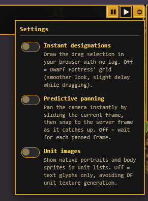
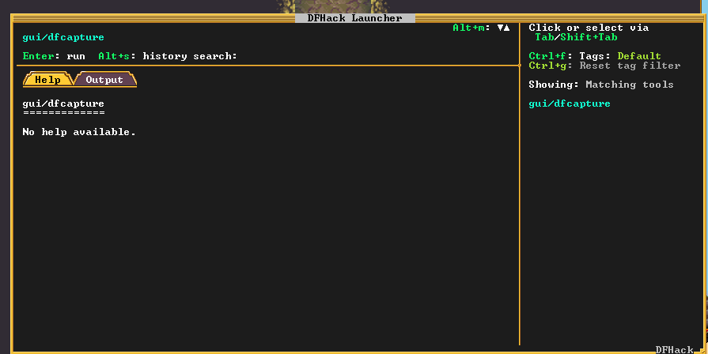
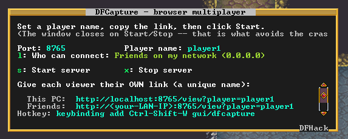

# Multi Dwarf / dfcapture — multiplayer Dwarf Fortress in your browser

A [DFHack](https://github.com/DFHack/dfhack) plugin that lets several people watch and
play **one shared Dwarf Fortress** from a web browser. The host runs the game & everyone
else opens a URL and gets their own independent camera, designations, menus, and HUD streamed live.

[Video showcase of the mod -older version though-](https://www.youtube.com/watch?v=5uvzqwSsfbQ)

## Important Notes

Would highly, highly recommend playing without the portraits, this feature is experimental and causes the game to crash frequently when the host
opens the Residents menu, or when both the host & remote player have the same unit window open.



Please collect crash logs and include them when submitting issues, lots to work on still!

## Install

1. Download the latest `dfcapture-…-DFHack-53.15-r1.zip` from the
   [**Releases**](../../releases) page.
2. Extract it, then copy the **`hack`** folder into your Dwarf Fortress directory — the
   one that already contains a `hack` folder (your DFHack install).
3. Start the game through DFHack as usual.


```
<Dwarf Fortress>/hack/
├── plugins/dfcapture.plug.dll        the plugin
├── dfcapture-web/                    the browser UI
├── lua/plugins/dfcapture.lua         plugin support code
└── scripts/gui/dfcapture.lua         the in-game control window
```

> **Version must match.** The `.plug.dll` only loads in the exact DFHack version it was
> built for (53.15-r1).

## Usage

In-game, open the DFHack launcher (**Ctrl-Shift-D**) and run **`gui/dfcapture`**. A small
window lets you **Start/Stop** the server, pick the **port**, choose **who can connect**
(your network vs. this PC only (for testing))



and



Give every viewer a link with their **own unique name** on the end:

- **You** connect at `http://localhost:8765/view?player=YOURNAME`.
- **Friends** connect at `http://<your-LAN-IP>:8765/view?player=THEIRNAME` (find `<your-LAN-IP>`
  by running `ipconfig` and reading the IPv4 Address; they must be on the same network or reach
  you through a forwarded port / VPN). I use PiVPN / WireGuard. Tailscale also works.
- Example after starting the server: http://192.168.1.202:8765/view?player=player1

Use a different name per viewer. You can use the same link as the host locally to see what your remote player is seeing, if you want.

If you prefer the command line, after the fortress is loaded, you can use `capture-stream-start 8765 0.0.0.0` and does the same thing, and
`capture-stream-stop` ends it. To put the window on a hotkey, add to
`<Dwarf Fortress>/hack/dfhack.init`:

For me it's: `& 'C:\Games\Steam\steamapps\common\Dwarf Fortress\hack\dfhack-run.exe' capture-stream-start 8765 0.0.0.0`


## Build from source (developers)

This is an *external* DFHack plugin so it builds as part of the DFHack source tree.

1. Clone DFHack at the matching tag, with submodules:
   ```
   git clone --recursive --branch 53.15-r1 https://github.com/DFHack/dfhack
   ```
2. Clone this repo into `dfhack/plugins/external/dfcapture/`.
3. Configure and build just this plugin (needs the DFHack build prerequisites, please see the
   [DFHack build docs](https://docs.dfhack.org/en/stable/docs/dev/compile/index.html);
   I used Visual Studio 2022):
   ```
   cmake -S dfhack -B dfhack/build -GNinja -DDFHACK_BUILD_ARCH=64 -DCMAKE_BUILD_TYPE=Release
   ninja -C dfhack/build dfcapture_public
   ```
   The result is `dfcapture.plug.dll`. Copy it (plus `web/`, `dfcapture.lua`, and
   `scripts/gui/dfcapture.lua`) into your DF `hack/` folder as shown above.

cpp-httplib is vendored in `third_party/cpp-httplib/`, so no external checkout is needed.


## License

dfcapture is licensed under the **GNU Affero General Public License v3.0** (AGPL-3.0-only) —
see [LICENSE](LICENSE). Because it serves over a network, the AGPL also requires offering
the source to people who use it remotely.

It builds on **DFHack** (Zlib), continues the approach of **DFPlex** (Zlib), descends from
**webfort** (ISC), and embeds **cpp-httplib** (MIT). Full attributions and their license
texts are in [NOTICE](NOTICE).
