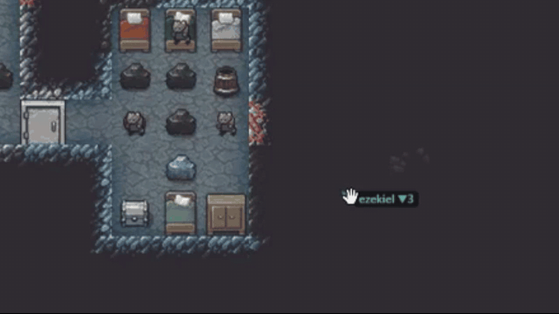
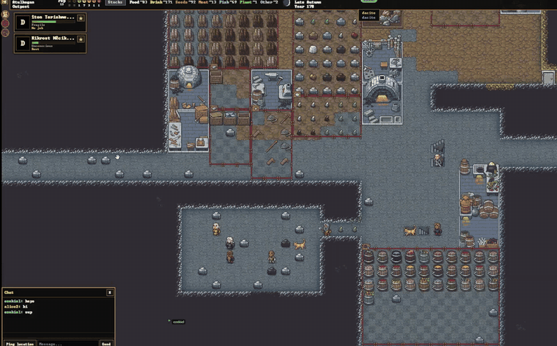
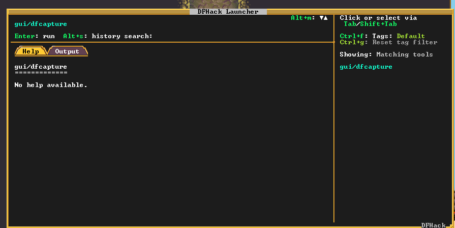
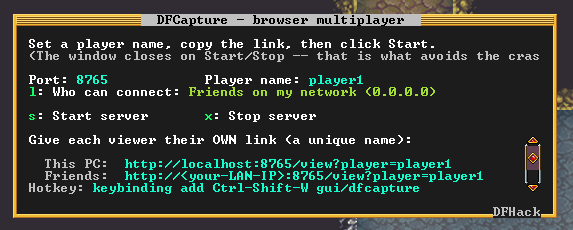

# Multi Dwarf / DFCapture — multiplayer Dwarf Fortress in your browser

A [DFHack](https://github.com/DFHack/dfhack) plugin that lets several people watch and
play **one shared Dwarf Fortress** through a web browser. The host runs the actual game &
everyone else opens a link and gets their own independent camera, controls, menus, and HUD.

The big thing I wanted to preserve is that this still looks like Dwarf Fortress. The browser is
showing the game's real rendered pixels, and the streaming has been improved so it can send only the parts of the screen that changed.

[Video showcase of the mod — older version though](https://www.youtube.com/watch?v=5uvzqwSsfbQ)

## What can you do with it?

- Every player gets their own camera, zoom, elevation, follow mode, cursors, pings, and bookmarks.





- Mine, chop trees, gather plants, smooth, engrave, build, place exact furniture, and manage
  stockpiles, zones, burrows, and hauling routes.
- Manage work orders, labors, workshops, kitchen rules, standing orders, squads, uniforms,
  schedules, hospitals, locations, nobles, and most everyday fortress administration.
- Use the trade depot and barter with merchants
- See alerts, petitions, diplomacy, reports, native popups, announcements, and what happened since
  you last connected.
- Chat, see what the other players are doing, and attribute buildings, zones, stockpiles, and work
  orders to the player who created them.
- Assign dwarves to players, favorite up to five of them, and keep small MMO-style HUDs open for
  their health and current activity.
- Player owned dwarves! Assign dwarves to yourself and favorite them to add them to your HUD.


## Important notes

This version is built for:

- **Dwarf Fortress 53.15**
- **DFHack 53.15-r1**
- **Windows x64**
- **Fortress mode**

The versions have to match. The plugin will not load in a different DFHack version. Apparently this works with Linux with Proton though.

This is meant for a trusted LAN or private VPN. I use PiVPN / WireGuard; Tailscale also works. Don't
forward the server port directly to the public internet.

Remote interaction is blocked while the host is saving, loading, or shutting down. The browser will
pause and show a notice until the fortress is ready again.

Please keep normal fortress backups and include your DFHack logs when reporting a crash.

## Install

1. Install **DFHack 53.15-r1 directly into your Dwarf Fortress game folder**.
2. Download `dfcapture-v0.9.46-DFHack-53.15-r1.zip` from the
   [**Releases**](../../releases) page.
3. Extract it, then copy the included **`hack`** folder into the Dwarf Fortress folder that contains
   `Dwarf Fortress.exe`. Merge it with the `hack` folder that is already there.
4. Start Dwarf Fortress normally with DFHack loaded.

The separate Steam `DFHack` folder is not the install for this plugin. The files need to be in
the actual Dwarf Fortress game folder. DFHack needs to be installed the old way:

```text
<Dwarf Fortress>/hack/
|-- plugins/dfcapture.plug.dll        the plugin
|-- dfcapture-web/                    the browser UI
|-- lua/plugins/dfcapture.lua         plugin support code
`-- scripts/gui/dfcapture.lua         the in-game control window
```

## Usage

In-game, open the DFHack launcher (**Ctrl-Shift-D**) and run:

```text
gui/dfcapture
```

A small window lets you start/stop the server





Give every viewer a link with their **own unique name** at the end:

- **You:** `http://localhost:8765/view?player=YOURNAME`
- **Friends:** `http://<your-LAN-IP>:8765/view?player=THEIRNAME`
- **Example:** `http://192.168.1.202:8765/view?player=player1`

Friends need to be on the same network or connected through your private VPN.

Use a different name for each viewer. You can also open another player's link locally if you want
to see exactly what they are seeing.

If you prefer the command line, load a fortress and use:

```text
capture-stream-start 8765 0.0.0.0
capture-stream-stop
```

## Build from source (developers)

This is an *external* DFHack plugin, so it builds as part of a matching DFHack source tree.

1. Clone DFHack at the matching tag, with submodules:

   ```powershell
   git clone --recursive --branch 53.15-r1 https://github.com/DFHack/dfhack
   ```

2. Clone this repository into `dfhack/plugins/external/dfcapture_public/`.
3. Configure DFHack using its normal Windows build instructions. I use Visual Studio 2022.
4. Build just this plugin:

   ```powershell
   cmake --build dfhack/build/VC2022 --config Release --target dfcapture_public
   ```

The result is `dfcapture.plug.dll`. Copy it, the `web/` directory, `dfcapture.lua`, and
`scripts/gui/dfcapture.lua` into the matching locations shown above.

`cpp-httplib` is vendored in `third_party/cpp-httplib/`, so no extra checkout is needed.


## License

DFCapture is licensed under the **GNU Affero General Public License v3.0** (AGPL-3.0-only) —
see [LICENSE](LICENSE). Because it serves over a network, the AGPL also requires offering the
source to people who use it remotely.

It builds on **DFHack** (Zlib), continues the approach of **DFPlex** (Zlib), descends from
**webfort** (ISC), and embeds **cpp-httplib** (MIT). Full third-party notices and license text are
in [NOTICE](NOTICE).
